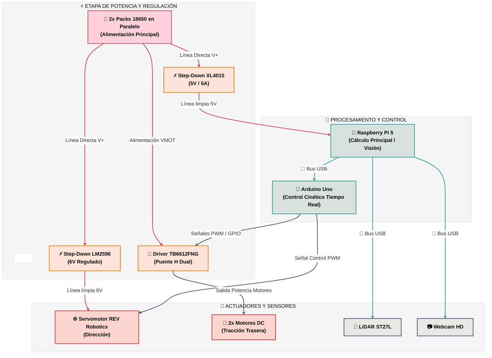

# Documento de Ingeniería / Red Machine

Este repositorio muestra todos los componentes para construir a "pompo", este robot autonomo pertenece al equipo "Red Machine" y cumple el proposito de participar en la categoria de futuros ingenieros en la WRO 2026.


# INDICE - REDMACHINE 2026

## 📌 CONTINIDO PRINCIPAL
1. [Documento de Ingeniería / Red Machine](#Engineering-Document--red-machine)
2. [Miembros de Red Machine](https://github.com/Samu4035/REDMACHINE-2025/tree/main?tab=readme-ov-file#Red-Machine-Members)
   - [Juan Diego Cano Barros](#-juan-diego-cano-barros)
   - [Samuel José Galban Franco](#-samuel-josé-galban-franco)
   - [Angel Saúl Rodriguez Guerra](#-angel-saúl-rodriguez-guerra)
3. [Development Stages (Previous robot versions)](https://github.com/Samu4035/REDMACHINE-2025/tree/main?tab=readme-ov-file#Development-stages-Previous-robot-versions)
4. [Robot Photos](#Robot-Photos-All-Angles)
5. [Mechanical desing](#Mechanical-Design)
   - [Mechanical Assembly Guide](#-Mechanical-Assembly-Guide--red-machine)
   - [General Structure](#-General-Structure)
   - [Drive and Steering Module](#-Drive-and-Steering-Module--red-machine)
6. [Electronic Components](#Electronic-Components)
   - [Description of Main System Components](#-Description-of-Main-System-Components)
7. [Robot Power Supply](#Robot-Power-Supply)
   - [Consumption calculation](#-Total-Energy-Consumption-Calculation)
8. [Image Processing](#Image-Processing)
   - [Color Detection](#Color-Detection)
9. [How to Run or Test the Project ](#How-to-Run-or-Test-the-Project)
10. [Second Challenge Code](https://github.com/Samu4035/REDMACHINE-2025/tree/main?tab=readme-ov-file#Second-Challenge-Code)
11. [First Challenge Explination](#First-Challenge-Explination)
12. [Videos](https://github.com/Samu4035/REDMACHINE-2025/tree/main?tab=readme-ov-file#Videos-of-Pompo-Operation--Version-3.0-Contemporary-Videos)
   - [Future Engineers - Challenge 1 Variant 1](https://youtu.be/I5WXGXlZpG4?si=D2IsjQdoafDccQmA)
   - [Future Engineers - Challenge 1 Variant 2](https://youtu.be/rjQujXqtAJU?feature=shared)
   - [Future Engineers - Challenge 1 Variant 3](https://youtu.be/9T3Q66ES2Qw?feature=shared)
   - [Future Engineers - Challenge 1 Variant 4](https://youtu.be/tL3BE26AJaA?feature=shared)
   - [Future Engineers-Reto 2](https://youtu.be/XvPb05R_A2o?si=kEyuvRi_PKU7EDct)
13. [Videos of Past Tests](https://github.com/Samu4035/REDMACHINE-2025/tree/main?tab=readme-ov-file#Videos-of-Past-Tests)
14. [Troubleshooting](#troubleshooting)
15. [History and Timeline](#History-and-Timeline-of-Red-Machine)
    - [2023 Season](#2023-Season)
    - [2024 Season](#2024-Season)
    - [2025 Season](#2025-Season)
    - [Robots Evolution](#julian-luka-and-pompo)

## 📂 ESTRUCTURA DEL REPOSITORIO
- [t-photos/](https://github.com/Samu4035/REDMACHINE-2025/tree/main/t-photos) - Fotos del equipo
- [v-photos/](https://github.com/Samu4035/REDMACHINE-2025/tree/main/v-photos) - Fotos del vehículo 
- [schemes/](https://github.com/Samu4035/REDMACHINE-2025/tree/main/schemes) - Diagramas Esquemáticos
- [src/](https://github.com/Samu4035/REDMACHINE-2025/tree/main/src) - Código
- [models/](https://github.com/Samu4035/REDMACHINE-2025/tree/main/models) - Diseño 3D
- [otros/](https://github.com/Samu4035/REDMACHINE-2025/tree/main/otros) - Otros archivos 

# Contenido

Este repositorio contiene los siguientes directorios para organizar nuestro proyecto:

* `t-photos`: Incluye fotos del equipo, así como fotos del trabajo realizado durante todos los años de competencia y fotos de los robots construidos por el equipo.
* `v-photos`: Contiene 6 fotos del vehículo (desde todos los ángulos).
* `schemes`: Diagramas esquemáticos (JPEG, PNG o PDF) de los componentes electromecánicos, que ilustran el cableado de los elementos electrónicos y motores, además de una explicación de la función de cada uno.
* `src`: Código del software de control para todos los componentes programados para la competencia.
* `models`: Archivos para el diseño 3D del vehículo.
* `other`: Archivos adicionales para entender cómo preparar el vehículo para la competencia.
     
# Introduccion
El equipo ha puesto su mayor esfuerzo en construir el mejor robot posible. Nuestra preparación para estas olimpiadas se ha basado en un amplio aprendizaje en construcción, diseño y programación, y la experiencia de competencias anteriores ha sido fundamental. Largas horas de análisis de pistas y estudio han llevado a la creación de nuestra propia estrategia, basada en los componentes con los que el equipo decidió trabajar, apuntando al mejor rendimiento posible en las distintas etapas de esta competencia.
A lo largo de este documento y de todo el repositorio, se explica con precisión todo el trabajo de diseño, programación y construcción del robot.


# Miembros de Red Machine

## 👤 Juan Diego Cano Barros

### Rol en el equipo
Responsable de la programación del robot y de la electrónica del mismo.

### 🧠 Logros académicos

- 🥉 **Medalla de Bronce – Olimpiada Iberoamericana de Matemáticas (2023)**
Representó a Venezuela en la 29ª edición de esta competencia internacional organizada por la OMA en Argentina, tras ser seleccionado entre los 10 mejores del segundo nivel nacional por @acmvenojm.

- 🥈 **Subcampeón – Argentine Mathematics Olympiad Ñandú (2019)**
Participó en el examen oral en Buenos Aires, destacándose como subcampeón en el Nivel 1.

---

### Antecedentes en robótica

- 🇻🇪 **Tricampeón Nacional – Categoría Futuros Ingenieros (WRO Venezuela)**
Ganador de la Olimpiada Nacional de Robótica en tres ediciones consecutivas, representando al estado Zulia y clasificando a las finales internacionales.

- 🌍 **Finalista Internacional – WRO Panamá 2023**
Representó a Venezuela en la Olimpiada Mundial de Robótica, ubicándose en el puesto 25 de 40 equipos en la categoría Futuros Ingenieros.

- 🇹🇷 **Participación Internacional – WRO Turquía 2024**
Formó parte de la delegación venezolana que compitió en la edición mundial celebrada en Turquía, consolidando experiencia en eventos globales de alto nivel.

---

### 💡 Motivación y Enfoque
Comer, dormir, conocer gente, disfrutar de los viajes y dormir

## 👤 Samuel José Galban Franco

### Rol en el equipo
Responsable del repositorio del robot.

### 🧠 Logros académicos

- 🥈 **Subcampeón – Olimpiada Nacional de Química (2024)**
Representó al Liceo Los Robles dicha edición de esta competencia organizada por AVOQUIM.

- 🥈 **Subcampeón – DESAFÍO VIRTUAL MISSIONS PANAMÁ 2023**
Segundo lugar en esta competencia internacional, representando a Venezuela durante la final internacional de la WRO 2023 celebrada en Panamá.

- 🥈 **Medalla de plata – Olimpiada internacional de nanotecnología INOHS**
Participación destacada en la final internacional, formando parte de la delegación Venezolana el año 2025. 

---

### 🤖 Antecedentes en robótica

- 🇻🇪 **Tricampeón Nacional – Categoría Futuros Ingenieros (WRO Venezuela)**
Ganador de la Olimpiada Nacional de Robótica en tres ediciones consecutivas, representando al estado Zulia y clasificando a las finales internacionales.

- 🌍 **Finalista Internacional – WRO Panamá 2023**
Representó a Venezuela en la Olimpiada Mundial de Robótica, ubicándose en el puesto 25 de 40 equipos en la categoría Futuros Ingenieros.

- 🇹🇷 **Participación Internacional – WRO Turquía 2024**
Formó parte de la delegación venezolana que compitió en la edición mundial celebrada en Turquía, consolidando experiencia en eventos globales de alto nivel.

---

### 💡 Motivación y Enfoque
Conocer gente, disfrutar de los viajes y buscar oportunidades de estudio


## 👤 Angel Saúl Rodriguez Guerra

### Rol en el equipo
Responsable de la mecánica del robot

### 🧠 Logros académicos
- 🥇 **Clasificado para el Mundial – Olimpiada Mundial Juvenil de Matemáticas (WYMO) (2024)**
Representó a Venezuela en la Olimpiada Mundial Juvenil de Matemáticas, una competencia internacional que reúne a jóvenes talentos de las matemáticas de todo el mundo para enfrentarse a problemas de alto nivel de exigencia.

- 🔬 **Participante destacado – Olimpiadas de Química y Matemáticas en Venezuela**
Competido en varias ediciones de las Olimpiadas venezolanas, demostrando excelencia y pasión por las ciencias exactas desde una edad temprana.

--- 

### 🤖 Antecedentes en robótica

- 🇻🇪 **Tricampeón Nacional – Categoría Futuros Ingenieros (WRO Venezuela)**
Ganador de la Olimpiada Nacional de Robótica en tres ediciones consecutivas, representando al estado Zulia y clasificando a las finales internacionales.

- 🌍 **Finalista Internacional – WRO Panamá 2023**
Representó a Venezuela en la Olimpiada Mundial de Robótica, ubicándose en el puesto 25 de 40 equipos en la categoría Futuros Ingenieros.

- 🇹🇷 **Participación Internacional – WRO Turquía 2024**
Formó parte de la delegación venezolana que compitió en la edición mundial celebrada en Turquía, consolidando experiencia en eventos globales de alto nivel.

--- 

### 💡 Motivación y Enfoque
Apasionado por el aprendizaje continuo, la resolución creativa de problemas y la colaboración en equipos multidisciplinarios. Su trayectoria en competencias académicas y tecnológicas refleja una motivación genuina para generar un impacto a través del conocimiento y seguir explorando nuevas fronteras del pensamiento científico y la innovación.

---


# ⚙️ Diseño y Fabricación Mecánica

## 1. Fabricación Digital y Selección de Materiales

* **Diseño CAD e Impresión 3D:** El vehículo fue modelado en software CAD (Autodesk Fusion 360 para volumetría 3D y AutoCAD para perfiles dimensionales de precisión). Toda la fabricación física se realizó en una impresora Creality K1 Max, lo que permitió iterar el chasis con soltura y ajustar tolerancias sobre la marcha.
* **Elección del PETG frente a otros materiales:**
  * **PLA:** Excesivamente rígido y frágil; propenso a fracturas ante impactos o vibraciones.
  * **ABS / ASA:** Propenso a contracción al enfriarse (*warping*), deformando piezas planas del chasis.
  * **Nylon (PA):** Alta higroscopía y mayor complejidad de procesamiento sin ventajas críticas inmediatas.
  * **PETG (Seleccionado):** Equilibrio perfecto entre tenacidad a impactos, flexibilidad justa, estabilidad dimensional y facilidad de procesamiento.
* **Parámetros de Impresión Predeterminados (Creality Print):**
  * **Temperatura de Boquilla:** 240 °C - 245 °C
  * **Temperatura de la Cama:** 70 °C - 80 °C
  * **Velocidad de Impresión:** 50 mm/s - 100 mm/s
  * **Relleno (Infill) y Patrón:** 15% - 20% (Grid / Gyroid)
  * **Enfriamiento de Capa:** 30% - 50%

---

## 2. Análisis Detallado del Chasis Inferior (Placa Base)


> *Ubicación del archivo de imagen: `image_d3fc48.png`*

* **Módulo Frontal de Dirección (Cuello y Alojamiento Servo):**
  * **Hueco Rectangular Central:** Diseñado a medida para embutir el servomotor de dirección a presión, evitando desplazamientos horizontales al aplicar torque.
  * **Orificios Pasantes M5:** Patrón de cuatro perforaciones perimetrales calibradas para tornillos M5 que fijan el subchasis superior de la dirección.
* **Módulo Trasero de Tracción (Caja, Motores y Salida de Ruedas):**
  * **Cavidades Longitudinales Dobles:** Espacios calados a medida para albergar dos motores eléctricos DC y definir la trocha trasera.
  * **Pieza de Acoplamiento Inter-Motor:** Canal central con puente rígido impreso que conecta ambos motores entre sí, eliminando torsiones independientes al acelerar.
  * **Aberturas Laterales Posteriores:** Muescas/huecos calados en los bordes laterales del chasis cerca del extremo trasero, diseñados específicamente para permitir el paso y salida de los ejes y neumáticos de tracción sin roces con la estructura.
* **Puntos de Fijación Posteriores:**
  * **Pestañas Traseras Perforadas:** Dos extensiones finales que sirven como puntos de anclaje traseros para la estructura del nivel superior.

---

## 3. Análisis Detallado del Segundo Piso y Unión entre Niveles


> *Ubicación del archivo de imagen: `image_d4c2dc.png`*

* **Unión Física entre el Primer y Segundo Piso:**
  * **Portabaterías como Columnas de Apoyo:** Los portabaterías dobles para celdas Li-Ion 18650 están colocados en los laterales entre ambas placas, funcionando como las paredes/columnas de soporte principales que elevan la estructura y bajan el centro de gravedad.
  * **Fijación Frontal con Dos Tornillos:** Dos tornillos pasantes atornillan la parte delantera del segundo piso al chasis inferior para eliminar vibraciones en la zona del sensor.
* **Componentes en la Cara Superior del Segundo Piso:**
  * **Raspberry Pi 5:** Montada en la zona central sobre cuatro orificios M3 con *standoffs* mecánicos para ventilación y aislamiento de vibraciones.
  * **Sensor LiDAR:** Instalado en la pestaña frontal elevada (~10 cm del suelo) para escanear la pista por encima de las paredes sin obstáculos ni puntos ciegos.
* **Componentes en la Cara Inferior del Segundo Piso (Montaje de Cabeza):**
  * **Ubicación Invertida:** El driver de potencia (Puente H) y los dos reductores de voltaje (Buck Converters) van suspendidos boca abajo en la cara inferior, orientados hacia el primer piso para ahorrar espacio superior.
  * **Sujeción por Remaches y Alambres:** Fijados combinando remaches rígidos contra vibraciones y alambres de amarre técnico que funcionan como abrazaderas sin ocupar volumen adicional con tuercas o tornillos.
  * **Alimentación Separada:** Reductores independientes para aislar la línea del procesador de la línea de potencia de los motores.

---

## 4. Módulo de Ruedas y Selección de Neumáticos


> *Ubicación del archivo de imagen: `image_d4dd01.jpg`*

* **Principio de Selección Combinada:** Se separaron técnicamente las funciones de tracción y dirección mediante la optimización de superficies de contacto, inercias y anchos de trocha.
* **Tren Trasero (Tracción):**
  * **Modelo de Rueda:** Ruedas Lego Technic medianas de banda ancha (49.5 x 20 mm).
  * **Transferencia de Torque y Agarre:** Banda de rodadura ancha y compuesto de goma suave para maximizar la superficie de contacto con la pista, evitando patinajes al acelerar a fondo con los motores DC.
  * **Empuje Homogéneo:** Diámetro adecuado para equilibrar torque y velocidad lineal sin sobrecargar la etapa de potencia.
* **Tren Delantero (Dirección):**
  * **Modelo de Rueda:** Ruedas Lego Technic pequeñas de bajo perfil montadas sobre manguetas articuladas Lego Technic.
  * **Menor Momento de Inercia:** Diámetro reducido y huella angosta que minimizan la resistencia a la rotación lateral, permitiendo virajes inmediatos sin forzar ni sobrecalentar el servomotor.
  * **Geometría y Dinámica:** Trocha delantera más estrecha para evitar el sobreviraje (*coleo/drifting*) y lograr curvas fluidas.
  * **Despeje Espacial:** Perfil bajo que evita interferencias mecánicas con el sensor LiDAR ubicado justo encima.

---

## 5. Evolución del Chasis y Prototipado CAD

El desarrollo del chasis no partió de un diseño final, sino de un proceso iterativo de prueba y corrección: cada versión se construyó para resolver un problema concreto detectado en la anterior. A continuación se documenta esa evolución.

### 5.1. Piso Inferior (Chasis Base)

**Prototipo 1 — Silueta monocapa (boceto de referencia)**

El primer prototipo fue una placa plana simple, sin ningún detalle funcional. Su objetivo no era ser una pieza definitiva, sino tener por primera vez una base física del robot que permitiera observar el avance real de la estructura y, sobre todo, medir con precisión dónde debían ubicarse los sensores, las tarjetas electrónicas y los motores dentro del chasis. Como era de esperarse, esta primera versión no era funcional: le faltaban todos los detalles específicos (cajas, huecos, anclajes) necesarios para encajar los componentes del robot.


**Prototipo 2 — Caja inferior integrada**

A partir de las medidas obtenidas en el Prototipo 1, se integró una caja diseñada a medida donde los motores encajan por presión, evitando así depender de tornillos u otro método de fijación adicional para sujetarlos. Este acople resultó tan preciso que se mantiene sin cambios hasta el diseño final. De igual forma, el hueco para el servomotor de dirección quedó correctamente dimensionado desde esta iteración y tampoco requirió modificaciones posteriores.


**Prototipo 3 — Nivelación de tracción y liberación de espacio para el LiDAR**

Con la caja de motores ya resuelta, surgió un nuevo problema: las ruedas de tracción trasera y las ruedas de dirección delantera no quedaban al mismo nivel. Para corregirlo, se profundizó la caja inferior hasta emparejar ambos ejes. Además, se eliminó el soporte delantero que existía hasta ese momento, ya que el LiDAR necesitaba ese mismo espacio libre para operar correctamente: mantenerlo habría bloqueado parte de su campo de visión.


**Iteración final del piso 1 — Corrección de estabilidad**

Durante las primeras pruebas de rodaje, el robot presentaba derrapes frecuentes por falta de estabilidad. La causa se rastreó hasta la orientación de los motores traseros, por lo que se invirtieron. Este cambio obligó también a repensar cómo se apoyaba el segundo piso sobre el primero, lo que llevó a una decisión clave del diseño: usar los propios portabaterías laterales como columnas estructurales de soporte entre ambos niveles, en lugar de agregar piezas adicionales solo para ese fin.

### 5.2. Segundo Piso y Torre del LiDAR

**Primer prototipo del segundo piso**

Esta primera versión incorporó la base de montaje de la Raspberry Pi y una elevación para sujetar el LiDAR desde arriba, condición necesaria para darle el campo de visión requerido. Ya incluía los agujeros de fijación del LiDAR, aunque el resto de la pieza aún era provisional.


**Segundo prototipo del segundo piso — Anclaje delantero**

Al eliminar en el Prototipo 3 del piso inferior el soporte delantero (por interferir con el LiDAR), se perdió también el punto que sostenía la parte frontal del robot. Se resolvió con un tornillo largo de aproximadamente 12 cm que atraviesa todo el vehículo: sujeta el servomotor, separa ambos pisos a la distancia correcta y llega hasta la parte superior del segundo piso, funcionando como eje de unión vertical.


**Restricción de altura del LiDAR**

Un condicionante que atravesó todo el rediseño del segundo piso fue que el campo de visión del LiDAR debe mantenerse por debajo de los 10 cm de altura. Los primeros puntos de apoyo ubicados en esa zona no tenían la resistencia estructural necesaria para sostener nada, así que tuvieron que descartarse. La solución definitiva combinó el tornillo largo pasante con los portabaterías laterales actuando como columnas, logrando una sujeción firme sin invadir el espacio que el LiDAR necesita para escanear la pista.

**Diseño final del segundo piso**

La versión definitiva se hizo más ancha para que los portabaterías apoyaran directamente contra el segundo piso (reforzando el punto anterior), e incorporó los huecos exactos para montar la Raspberry Pi de forma visible en la cara superior, y el puente H junto con los reguladores de voltaje boca abajo en la cara inferior, aprovechando así el espacio disponible.


### 5.3. Validación con el Prototipo Ensamblado

Antes de dar por cerrado el diseño, se realizó un primer ensamblaje físico completo (dos pisos, ruedas, motores y estructura de sujeción del sensor) para validar que el conjunto funcionara como se había planeado en CAD. Esta prueba confirmó que el enfoque general era el correcto, y fue precisamente al intentar montar los sensores sobre esta estructura que se detectaron las limitaciones de altura del LiDAR descritas en la sección anterior, lo que disparó los ajustes finales del segundo piso y del sistema de anclaje.


### 5.4. Prototipo Final Ensamblado (Red Machine)

Como resultado de todo este proceso iterativo —resolver primero la caja de motores, luego nivelar la tracción, después liberar espacio para el LiDAR, y finalmente resolver el anclaje delantero y la estabilidad del segundo piso— se llegó al ensamble físico final: una estructura de dos niveles con dirección híbrida PETG-Lego, soporte de LiDAR elevado por debajo del límite de 10 cm, portabaterías 18650 laterales que cumplen doble función (energía y soporte estructural), y Raspberry Pi 5 montada en la cara superior del segundo piso junto a su disipador de calor.


---

## 6. Módulo de Tracción y Centro de Masa

* **Tracción Trasera:** Transmisión directa de potencia desde los motores DC traseros.
* **Centro de Gravedad Bajo (CoG):** Ubicación de los componentes pesados (baterías 18650, Arduino y cableado) en la zona baja e intermedia para evitar vuelcos y dar estabilidad en curvas.

---

## 7. Módulo de Dirección y Comportamiento Dinámico

* **Reducción de Trocha Delantera:** Eje delantero más estrecho que el trasero para acortar el brazo de palanca al girar.
* **Eliminación del Sobreviraje:** Control del agarre en curvas evitando derrapes indeseados (*drifting*) o mordidas bruscas del tren delantero.
* **Acoplamiento Servo-Lego:** Uso de manguetas Lego Technic accionadas por el servomotor para eliminar holguras y suavizar la dirección.

---

## 8. Integración de Sensores y Estructura Superior

* **Posición Estratégica del LiDAR:** Elevación a ~10 cm sobre las paredes de la pista para un escaneo claro en ~270°.
* **Rigidez Estructural:** Fijación rígida entre tornillos pasantes y paredes laterales de baterías que evita flexiones, vibraciones o descalibraciones en las lecturas de los sensores.
* **Gestión de Cableado:** Canales entre pisos para proteger las conexiones eléctricas entre los componentes.
# Explicación Detallada de los Componentes

### Raspberry Pi 5
Computadora monoplaca de alto rendimiento equipada con un procesador Broadcom BCM2711 Quad-Core ARM Cortex-A72 a 1.5 GHz. Funciona como la unidad central de cómputo del robot, asumiendo el procesamiento pesado de imágenes capturadas por la webcam y la gestión de la nube de puntos transmitida por el Lidar ST27L. Su arquitectura ARM de 64 bits y su memoria RAM permiten ejecutar la pila del sistema operativo Linux (UBUNTU) e hilos paralelos mediante Python, garantizando que el procesamiento visual intensivo y la construcción del mapa espacial no generen cuellos de botella ni bloqueen las respuestas dinámicas del vehículo en la pista. Fue especificamente utilizada por encima de la raspberry pi 4, ya que completa cada iteracion del codigo un 13% mas rapido, ofreciendo aun mas precision, siendo muy relevante para el uso del lidar.


---

### Arduino Uno
Microcontrolador de 8 bits basado en el chip ATmega328P que opera a una frecuencia de reloj de 16 MHz. Dentro de la arquitectura del robot, se desempeña como el nodo de control en tiempo real dedicado a la ejecución de tareas críticas de bajo nivel. Recibe las directivas de movimiento enviadas desde la Raspberry Pi y genera las señales PWM hacia el driver de motores TB6612FNG y al servomotor. Al delegar la temporización estricta de las salidas lógicas a este microcontrolador, se evita que las interrupciones del sistema operativo de la Raspberry Pi causen fluctuaciones en la velocidad de las ruedas o imperfecciones en la respuesta de los actuadores. El arduino uno fue utilizado principalmente para facilitar la construccion de este chasis, debido a que otro tipo de microcontroladores son mucho mas dificiles de encontrar por lo tanto dificultarian poder replicar el chasis.


---

### Lidar LDROBOT ST27L
Sensor óptico de medición de distancia omnidireccional basado en la tecnología dToF (Direct Time-of-Flight), capaz de realizar escaneos de 360° en el plano horizontal a rangos de hasta 25 metros. Emite pulsos de luz láser infrarroja y mide el tiempo exacto que tardan en rebotar contra los obstáculos, generando una matriz de coordenadas espaciales en tiempo real. Esta información es fundamental para los algoritmos de navegación y evasión de paredes, ofreciendo una inmunidad total ante cambios bruscos de iluminación ambiental, sombras sobre la pista o variaciones en el color de la superficie de los muros. Se utiliza el lidar en contraste a los ultrasonidos para obtener una precision ~99.1%, debido a que trabajamos con mayor cantidad de datos, donde somos capaces de trazar una recta que se asemeja a la de las paredes en un 93,4%, lo cual asegura que la raspberry pi no confunda las paredes de la pista con cualquier otro obstaculo de la pista, tales como los conos o los estacionamientos.


---

### Servomotor REV Robotics
Actuador de dirección de grado robótico con piñonería interna metálica de alta resistencia y motor integrado de corriente continua, optimizado para operar a 6.0 V con un torque de hasta 13.5 kg-cm. Su función principal es posicionar el mecanismo del tren delantero para cambiar la trayectoria del vehículo. Su electrónica digital interna ajusta la posición del eje con alta precisión angular, manteniendo el ángulo de dirección fijo sin ceder ante las fuerzas de fricción de las ruedas sobre la pista o las inercias generadas durante cambios de dirección a alta velocidad.


---

### Driver TB6612FNG (Puente H Dual)
Módulo controlador de motores basado en una etapa de potencia MOSFET de baja resistencia interna en estado activo (Rds(on)). Permite manejar dos motores DC en paralelo con una corriente continua de hasta 1.2 A por canal (3.2 A pico). Al utilizar transistores MOSFET en lugar de los antiguos transistores bipolares, ofrece una eficiencia energética superior con una disipación de calor mínima, respondiendo de forma lineal a las señales de ciclo de trabajo PWM de hasta 100 kHz enviadas por el Arduino Uno para regular aceleraciones y frenados. Fue un cambio al antiguo puente h l298n, debido a que este nos ofrece mas eficiencia, en un espacio muchisimo menor, permitiendonos hacer todos los cambios fisicos exigidos.


---

### Cámara Webcam
Sensor de captura de imagen HD conectado vía USB a la Raspberry Pi, dedicado a la adquisición de cuadros de video en tiempo real. Proporciona el flujo de datos visuales necesario para que los algoritmos de visión artificial procesen el entorno, detecten patrones cromáticos, identifiquen señales de tráfico y reconozcan elementos clave del circuito. Su integración directa al bus USB 3.0 de la Raspberry Pi permite la transmisión fluida de imágenes sin sobrecargar el bus de comunicación serie del microcontrolador de bajo nivel.

*(Espacio para foto de la Webcam)*

---

### Banco de Baterías 18650 (Arreglo 2S2P)
Fuente de alimentación principal conformada por cuatro celdas cilíndricas recargables de Ion de Litio (Li-ion) formato 18650, configuradas en dos ramas en paralelo de dos celdas en serie cada una. Entrega una tensión nominal de 7.4 V (8.4 V a plena carga) y una capacidad acumulada de 4000 mAh. Esta química de batería ofrece una resistencia interna extremadamente baja, lo que permite suministrar ráfagas elevadas de corriente sin sufrir caídas parásitas de voltaje (*brownouts*) cuando los motores de tracción y el servo de dirección demandan torque máximo en momentos de alta aceleración.


---

### Reductor de Voltaje XL4015 (Step-Down 5 A)
Convertidor conmutado de corriente continua (*Buck Converter*) capaz de transformar el voltaje variable del banco de baterías (7.4 V – 8.4 V) en una línea regulada estable de 5.0 V DC con capacidad de suministro de hasta 5 A. Su frecuencia de conmutación interna y su alto rendimiento energético (hasta el 96%) evitan el desperdicio de energía en forma de calor residual, suministrando una alimentación limpia e inmune a ruidos electromagnéticos a la Raspberry Pi, la cual a su vez energiza la webcam, el Lidar ST27L y el Arduino Uno. Este componente es estrictamente necesario, debido a que la mayoria de reductores de voltaje de bajo costo suministran una cantidad menor a 4A, lo cual es necesario para el correcto funcionamiento de la raspberry pi, y por lo tanto de sus componentes adyacentes


---

### Reductor de Voltaje LM2596 (Step-Down 3 A)
Regulador conmutado independiente que opera a una frecuencia de 150 kHz, dedicado a transformar la tensión de las baterías en una salida fija de 6.0 V DC para la etapa de dirección. Al estar aislado de la línea de 5.0 V de la computadora principal, absorbe los picos térmicos y electromagnéticos que genera el servomotor REV Robotics durante sus movimientos bruscos, previniendo que el ruido inductivo del motor o los bajones de tensión repentinos causen reinicios imprevistos en la Raspberry Pi o fallas de sincronía en el Lidar.


---

# Alimentación del Robot

El sistema de energía del robot está estructurado mediante dos reguladores *step-down* conectados al paquete principal de baterías:

- **Línea de Cómputo y Percepción:** El regulador XL4015 reduce el voltaje de las baterías a 5 V estables para alimentar la Raspberry Pi. Esta, a su vez, distribuye energía al Arduino Uno, al Lidar LDROBOT ST27L y a la webcam a través de sus puertos USB e interfaces de alimentación.
- **Línea de Actuación (Servo):** El regulador LM2596 ajusta la tensión a 6 V para alimentar de forma dedicada el servomotor REV Robotics, aislando sus picos de corriente del resto del circuito lógico.
- **Línea de Tracción:** Las baterías alimentan directamente la entrada de potencia del puente H TB6612FNG, el cual distribuye la energía a ambos motores de tracción conectados en paralelo.

---

### 🔋 Cálculo del Consumo Total de Energía

| Componente | Cantidad | Consumo estimado (mA) | Total (mA) |
|:---|:---:|:---:|:---:|
| Raspberry Pi (con Webcam) | 1 | 1200 mA | 1200 mA |
| Lidar LDROBOT ST27L | 1 | 350 mA | 350 mA |
| Arduino Uno | 1 | 50 mA | 50 mA |
| Servomotor REV Robotics | 1 | 180 mA (típico) | 180 mA |
| Motores de Tracción (en paralelo) | 2 | 500 mA c/u | 1000 mA |
| **TOTAL** | — | — | **2780 mA** |

---

### ⚡ Distribución de Potencia y Autonomía Estimada

El sistema se alimenta de forma distribuida para optimizar la eficiencia y proteger los componentes sensibles contra ruido inductivo:

- 🔌 **Línea Regulada XL4015 (5V):** Raspberry Pi, Webcam, Lidar ST27L y Arduino Uno.
- 🔌 **Línea Regulada LM2596 (6V):** Servomotor REV Robotics.
- 🔋 **Alimentación Directa a Puente H TB6612FNG:** Motores de tracción conectados en paralelo.

| Fuente de Alimentación | Componentes Alimentados | Consumo Estimado (mA) | Capacidad Aprox. |
|:---|:---|:---:|:---:|
| Regulador XL4015 (Salida 5V) | Raspberry Pi, Webcam, Lidar, Arduino | ~1600 mA | 4000 mAh |
| Regulador LM2596 (Salida 6V) | Servomotor REV Robotics | ~180 mA | 4000 mAh |
| Puente H TB6612FNG (Directo) | Motores de Tracción (en paralelo) | ~1000 mA | 4000 mAh |

> 💡 *Nota:*  Al momento de utilizarlos todos en conjunto tienen una autonomia estimada de 1.2 horas de forma eficiente
> 

# Buenas Prácticas de Cableado, Eficiencia y Seguridad

* **Estandarización de colores por función:** Se utilizó el mismo color de cable para cada tipo de línea en todo el robot (rojo para positivo, negro para tierra, azul para señales PWM, amarillo/verde para comunicación). Esto evita confusiones durante las reparaciones y previene conexiones cruzadas accidentales. En competencias pasadas esto no era un estandar, lo que generaba confusiones al momento de la reparacion

* **Separación física de cables de energía y datos:** Se pasaron los cables gruesos que llevan energía a los motores por un lado del chasis y los cables delgados que llevan información a la Raspberry Pi, Lidar y Arduino por el otro. Mantenerlos alejados evita que la fuerza de los motores cause interferencias en las lecturas de los sensores.

* **Trenzado de cables de alimentación:** Los cables de corriente (positivo y negativo) que van hacia los motores y los reguladores se enrollaron juntos en pares trenzados. Esta forma de enroscarlos ayuda a cancelar de forma natural el ruido magnético que generan sobre el resto de la electrónica. De igualmente facilitan solucionar cualquier error, ya que hay mucho menor volumen de cables

* **Uso de tubos termorretráctiles (Thermoshrink) en las soldaduras:** Cada unión soldada se cubrió con tubo termorretráctil en lugar de usar cinta aislante. Esto garantiza que las soldaduras no queden expuestas, evitando cortocircuitos por contacto accidental con el chasis u otros componentes.

* **Agrupado con precintos y fundas espirales:** Se utilizaron precintos plásticos y fundas para juntar los cables en ramas ordenadas. Esto evita que queden cables sueltos que puedan engancharse con las ruedas, el servomotor o con elementos externos de la pista mientras el robot se desplaza.

* **Alivio de tensión en zonas con movimiento:** En los cables que van conectados a partes móviles, como el servomotor de la dirección, se dejó una ligera curvatura de margen y se sujetó el cable al chasis justo antes del conector. Así, el tirón del movimiento lo absorbe la estructura del robot y no los pines del componente.


##  Arquitectura Funcional y Distribución Eléctrica

El diseño eléctrico e informático del vehículo se estructura en cuatro capas principales, ideadas para maximizar el rendimiento computacional, aislar las interferencias electromagnéticas y asegurar tiempos de reacción inmediatos en la pista:

#### 1. Capa de Distribución Energética (Power Layer)
El suministro eléctrico nace de un arreglo de almacenamiento principal (dos paquetes de dos baterías 18650 conectadas en paralelo). A partir de este nodo, la energía se ramifica de manera independiente:

*   **Regulador XL4015 (Núcleo Lógico):** Convierte el voltaje del banco de baterías en una salida constante de 5.0V con un límite de hasta 5A. Esta fuente de alta capacidad está dedicada enteramente a sostener el consumo de la Raspberry Pi 5, permitiéndole alimentar sin problemas a los dispositivos conectados a sus propios puertos.
*   **Regulador LM2596 (Fuerza de Dirección):** Crea una línea de alimentación completamente aislada del resto del sistema, enfocada de manera exclusiva en el servomotor REV Robotics. Esta separación física evita que las caídas de voltaje producidas al girar las ruedas delanteras interfieran con la estabilidad de los procesadores.
*   **Derivación Directa a Tracción:** El voltaje íntegro de las celdas 18650 se conecta de forma directa a la entrada de fuerza del controlador de motores (TB6612FNG), asegurando que los motores tengan acceso instantáneo a la corriente máxima requerida para la aceleración.

#### 2. Nivel de Procesamiento Jerárquico (Compute Layer)
La inteligencia del robot opera mediante un esquema de delegación de tareas para evitar sobrecargas informáticas:

*   **Computadora Central (Raspberry Pi 5):** Funciona como el cerebro de la operación. Aprovechando su gran poder de cálculo, gestiona de forma exclusiva los algoritmos pesados de visión artificial y la construcción del mapa Lidar. Paralelamente, actúa como el concentrador central (Hub) que provee datos y energía USB al resto de la electrónica lógica.
*   **Controlador Cinético (Arduino Uno):** Alimentado y comunicado a través de un puerto USB de la Raspberry Pi 5, este microcontrolador se libera de los cálculos complejos para enfocarse 100% en el manejo de tiempos reales. Transforma las instrucciones recibidas en señales PWM exactas para gobernar el puente H y el servomotor.
*   **Unificación de Masas (Star Grounding):** Para garantizar que los niveles lógicos sean leídos correctamente, todos los retornos negativos (GND) se referencian a un único punto central vinculado a la Raspberry Pi 5, previniendo errores de voltaje en las comunicaciones.

#### 3. Etapa de Tracción y Movilidad (Motor Control Layer)
La ejecución física de los comandos de aceleración recae sobre el puente H TB6612FNG, optimizado para operaciones de alta eficiencia:

*   **Traducción de Comandos:** Recibe las señales digitales (dirección y PWM) enviadas por los pines de salida del Arduino Uno. Gracias a sus transistores internos de baja pérdida, reacciona instantáneamente para aplicar frenados dinámicos o cambios de velocidad.
*   **Empuje Sincronizado:** Las salidas de potencia de este módulo se enlazan a los dos motores de tracción que comparten una conexión en paralelo. Esto fuerza a ambos motores a recibir el mismo diferencial eléctrico, garantizando un empuje equilibrado y lineal en las ruedas.

#### 4. Subsistema de Percepción del Entorno (Sensor Layer)
El monitoreo del circuito se lleva a cabo mediante periféricos de alto flujo de datos conectados de forma nativa a los puertos de la computadora principal:

*   **Escaneo Láser (Lidar LDROBOT ST27L):** Aporta la telemetría espacial escaneando los obstáculos a su alrededor en 360 grados. Obtiene tanto su energía como su canal de comunicación a través de un cable USB conectado directo a la Raspberry Pi 5, inyectando su nube de puntos a alta velocidad.
*   **Visión Computacional (Webcam HD):** Captura las referencias visuales y marcadores de color del circuito. Su interfaz USB envía el flujo de imágenes directamente al procesador de la Raspberry Pi 5 sin pasar por el Arduino, evitando cualquier tipo de retraso o cuello de botella en los buses del microcontrolador de bajo nivel.


A continuacion, un diagrama que demuestra de manera mas sencilla la forma en la que se alimenta el robot



## Preparación de la Raspberry Pi

### Descarga e instalación de Ubuntu Server en la microSD

En tu ordenador local, descarga e instala **Raspberry Pi Imager** desde [https://www.raspberrypi.com/software/](https://www.raspberrypi.com/software/). En Ubuntu, puedes instalarlo con:

```bash
sudo snap install rpi-imager
```

Inserta la microSD (mínimo 16 GB, clase 10) en tu lector. Abre Raspberry Pi Imager y sigue estos pasos:
- **Choose OS** → Other specific-purpose OS → Ubuntu → **Ubuntu Server 24.04 LTS (64‑bit)**.
- **Choose Storage** → selecciona tu microSD.

Haz clic en el engranaje (⚙️) para la configuración avanzada:
- Marca **Set hostname** y escribe, por ejemplo, `wro-robot`.
- Marca **Enable SSH** y elige **Use password authentication**.
- Establece el usuario y contraseña que usarás, por ejemplo: Usuario: `wro`, Contraseña: `wro2025`.
- Marca **Configure wireless LAN** e introduce el SSID y la contraseña de tu red Wi‑Fi.
- Marca **Set locale settings**: elige `es_ES.UTF-8` y `Europe/Madrid`.

Haz clic en **Write** y espera a que termine la escritura. Una vez escrita, retira la microSD, insértala en la Raspberry Pi y conecta la alimentación USB‑C.

### Primer arranque y configuración inicial

Al encender, Ubuntu Server arrancará y mostrará un prompt de inicio de sesión. Inicia sesión con el usuario y contraseña que configuraste.

Ejecuta los siguientes comandos para actualizar el sistema e instalar herramientas básicas:

```bash
sudo apt update && sudo apt upgrade -y
sudo apt install -y net-tools git vim curl wget htop
```

Configura la zona horaria y sincroniza la hora (importante para ROS 2 y certificados):

```bash
sudo timedatectl set-timezone Europe/Madrid
sudo apt install -y ntp
sudo timedatectl set-ntp true
```

Reinicia para asegurar que todos los cambios se aplican:

```bash
sudo reboot
```

### Configuración de la red (Wi‑Fi e IP fija)

Si configuraste el Wi‑Fi en el Imager, ya deberías tener conexión. Para verificar:

```bash
ip a
ping -c 4 google.es
```

Para asignar una IP fija (recomendado para SSH), editamos el archivo de configuración de Netplan:

```bash
sudo nano /etc/netplan/50-cloud-init.yaml
```

Sustituye el contenido por el siguiente (ajusta la IP, puerta de enlace y SSID/contraseña a tu red):

```yaml
network:
  version: 2
  ethernets:
    eth0:
      dhcp4: true
      optional: true
  wifis:
    wlan0:
      dhcp4: false
      addresses:
        - 192.168.1.100/24
      routes:
        - to: default
          via: 192.168.1.1
      nameservers:
        addresses: [8.8.8.8, 1.1.1.1]
      access-points:
        "nombre_de_tu_wifi":
          password: "tu_contraseña"
```

Guarda con `Ctrl+O`, Enter, y sal con `Ctrl+X`. Aplica la configuración:

```bash
sudo netplan apply
```

Verifica que tienes la IP asignada:

```bash
hostname -I
```

Anota la IP (ej. `192.168.1.100`).

### Habilitación y configuración de SSH

SSH ya debería estar activo si lo marcaste en el Imager. Para asegurarte:

```bash
sudo systemctl enable ssh
sudo systemctl start ssh
```

Desde tu ordenador local, prueba la conexión:

```bash
ssh wro@192.168.1.100
```

Si todo funciona, ya puedes trabajar sin monitor ni teclado.

---

## Instalación de ROS 2 Jazzy en la Raspberry Pi

Seguimos la [guía oficial de ROS 2 Jazzy para Ubuntu 24.04](https://docs.ros.org/en/humble/Installation/Ubuntu-Install-Debians.html).

### Configuración del locale

```bash
sudo apt update && sudo apt install -y locales
sudo locale-gen es_ES es_ES.UTF-8
sudo update-locale LC_ALL=es_ES.UTF-8 LANG=es_ES.UTF-8
export LANG=es_ES.UTF-8
```

Añade la variable al final de `~/.bashrc` para que persista:

```bash
echo "export LANG=es_ES.UTF-8" >> ~/.bashrc
```

### Adición del repositorio de ROS 2

```bash
sudo apt install -y software-properties-common
sudo add-apt-repository universe
sudo apt update && sudo apt install -y curl
sudo curl -sSL https://raw.githubusercontent.com/ros/rosdistro/master/ros.key -o /usr/share/keyrings/ros-archive-keyring.gpg
echo "deb [arch=$(dpkg --print-architecture) signed-by=/usr/share/keyrings/ros-archive-keyring.gpg] http://packages.ros.org/ros2/ubuntu $(. /etc/os-release && echo $UBUNTU_CODENAME) main" | sudo tee /etc/apt/sources.list.d/ros2.list > /dev/null
```

### Instalación de ROS 2 Humble

```bash
sudo apt update
sudo apt upgrade -y
sudo apt install -y ros-Jazzy-desktop
sudo apt install -y python3-colcon-common-extensions python3-rosdep python3-pip
```

### Configuración del entorno

Añade el sourcing de ROS 2 a tu `.bashrc`:

```bash
echo "source /opt/ros/jazzy/setup.bash" >> ~/.bashrc
echo "source /usr/share/colcon_argcomplete/hook/colcon-argcomplete.bash" >> ~/.bashrc
source ~/.bashrc
```

Inicializa `rosdep`:

```bash
sudo rosdep init
rosdep update
```

---

## Configuración del entorno de desarrollo en tu ordenador local

Vamos a usar **Visual Studio Code** con la extensión **Remote‑SSH** para editar y ejecutar código directamente en la Raspberry Pi.

### Instalación de Visual Studio Code

Descarga e instala VS Code desde [https://code.visualstudio.com/](https://code.visualstudio.com/). En Ubuntu:

```bash
sudo snap install --classic code
```

### Instalación de la extensión Remote‑SSH

Abre VS Code, ve a la pestaña de Extensiones (Ctrl+Shift+X) y busca **Remote - SSH**. Instala la extensión de Microsoft.

### Configuración de la clave SSH para la Raspberry Pi (recomendado)

Para no tener que escribir contraseña cada vez, genera un par de claves en tu ordenador local:

```bash
ssh-keygen -t rsa -b 4096 -C "wro-robot"
```

Copia tu clave pública a la Raspberry Pi:

```bash
ssh-copy-id wro@192.168.1.100
```

Prueba que ya no pide contraseña: `ssh wro@192.168.1.100`.

### Conexión remota a la Raspberry Pi desde VS Code

En VS Code, haz clic en el icono de **Remote Explorer**. Elige **"Add New SSH Host..."** y escribe `wro@192.168.1.100`. Una vez añadido, haz clic en el icono de conexión para abrir una sesión remota.

---

## Preparación del código en la Raspberry Pi

### Creación del workspace de ROS 2

```bash
mkdir -p ~/wro_ws/src
cd ~/wro_ws
```

### Creación del paquete y del nodo

```bash
cd ~/wro_ws/src
ros2 pkg create --build-type ament_python wro_reto_abierto
cd wro_reto_abierto
rm -rf wro_reto_abierto/*.py
touch wro_reto_abierto/wro_reto_abierto_node.py
chmod +x wro_reto_abierto/wro_reto_abierto_node.py
```

Edita el `setup.py` para que el punto de entrada apunte a nuestro nodo:

```python
entry_points={
    'console_scripts': [
        'wro_node = wro_reto_abierto.wro_reto_abierto_node:main',
    ],
},
```

### Instalación de dependencias Python

```bash
sudo pip3 install numpy pyserial
```

---

## Configuración del Arduino Uno

### Instalación del Arduino IDE en Ubuntu

```bash
sudo apt install -y arduino arduino-core
```

### Configuración de permisos del puerto serial

```bash
sudo usermod -a -G dialout wro
```

### Conexión física del Arduino Uno a la Raspberry Pi

Conecta el Arduino Uno a la Raspberry Pi mediante un cable USB tipo B.

### Compilación y carga del código en el Arduino

Crea un archivo `sketch.ino`:

```bash
mkdir -p ~/arduino_sketch
nano ~/arduino_sketch/sketch.ino
```

Código completo del Arduino:

```cpp
#include <Servo.h>

const int pinMotor1 = 4;
const int pinMotor2 = 5;
const int pinServo  = 7;

Servo miServo;

void fijarMotor(int velocidad) {
  velocidad = constrain(velocidad, -150, 150);
  if (velocidad > 0) {
    int pwmResta = 150 - velocidad; 
    analogWrite(pinMotor1, 150);
    analogWrite(pinMotor2, pwmResta);
  } else if (velocidad < 0) {
    int pwmResta = 150 - abs(velocidad);
    analogWrite(pinMotor1, pwmResta);
    analogWrite(pinMotor2, 150);
  } else {
    digitalWrite(pinMotor1, LOW);
    digitalWrite(pinMotor2, LOW);
  }
}

void setup() {
  Serial.begin(115200); 
  pinMode(pinMotor1, OUTPUT);
  pinMode(pinMotor2, OUTPUT);
  miServo.attach(pinServo);
  miServo.write(57);
  fijarMotor(0);
}

void loop() {
  if (Serial.available() > 0) {
    String entrada = Serial.readStringUntil('\n');
    entrada.trim();
    if (entrada.length() > 0) {
      char tipoComando = toupper(entrada.charAt(0)); 
      if (tipoComando == 'S') {
        int angulo = entrada.substring(1).toInt();
        angulo = constrain(angulo, 30, 90);
        miServo.write(angulo);
      } else if (tipoComando == 'M') {
        int velocidad = entrada.substring(1).toInt();
        fijarMotor(velocidad);
      } else if (isDigit(tipoComando) || tipoComando == '-') {
        int angulo = entrada.toInt();
        angulo = constrain(angulo, 30, 90);
        miServo.write(angulo);
      }
    }
  }
}
```

**Carga del sketch** con `arduino-cli`:

```bash
curl -fsSL https://raw.githubusercontent.com/arduino/arduino-cli/master/install.sh | sh
sudo mv bin/arduino-cli /usr/local/bin/
arduino-cli compile --fqbn arduino:avr:uno ~/arduino_sketch/
arduino-cli upload -p /dev/ttyACM0 --fqbn arduino:avr:uno ~/arduino_sketch/
```

---

## Comunicación Serial entre ROS 2 y Arduino

### Identificación del puerto serial

```bash
ls /dev/ttyACM*
```

Normalmente aparecerá `/dev/ttyACM0`.

### Permisos del puerto serial

```bash
sudo chmod 666 /dev/ttyACM0
sudo usermod -a -G dialout $USER
```

### Creación de una regla udev permanente

```bash
sudo nano /etc/udev/rules.d/99-arduino.rules
```

Contenido:
```
SUBSYSTEM=="usb", ATTRS{idVendor}=="2341", ATTRS{idProduct}=="0043", MODE="0666"
```

Recarga las reglas:

```bash
sudo udevadm control --reload-rules
sudo udevadm trigger
```

---

## Compilación y ejecución del proyecto

### Compilación del workspace

```bash
cd ~/wro_ws
colcon build --symlink-install
```

### Configuración de variables de entorno

```bash
echo "source ~/wro_ws/install/setup.bash" >> ~/.bashrc
source ~/.bashrc
```

### Creación del archivo del nodo Python

```bash
nano ~/wro_ws/src/wro_reto_abierto/wro_reto_abierto/wro_reto_abierto_node.py
```

### Ejecución del nodo

```bash
ros2 run wro_reto_abierto wro_node
```

---

## Explicación Detallada del Código del Reto Abierto y su Lógica 

He diseñado este sistema con una arquitectura cliente-servidor donde la Raspberry Pi (ROS 2) actúa como el cerebro principal que procesa los datos del LiDAR y toma decisiones de alto nivel, mientras que el Arduino Uno se encarga del control en tiempo real de los actuadores.

### Lógica de Navegación Global

El flujo de navegación que he implementado sigue un ciclo continuo basado en la detección del entorno:


### Explicacion codigo Reto Abierto (Nodo ROS 2)

He estructurado el nodo en varias capas funcionales para mantener el código limpio y modular.

#### 1. Configuración Inicial y Parámetros

En el método `__init__`, he declarado todos los parámetros ajustables que permiten modificar el comportamiento del robot sin recompilar:

```python
self.declare_parameter('sentido', 0)                    # Dirección de giro (0=desconocido)
self.declare_parameter('distancia_objetivo', 0.4)      # Distancia deseada a la pared (metros)
self.declare_parameter('distancia_frontal_obstaculo', 0.35)  # Umbral para detectar pared frontal
self.declare_parameter('velocidad_motor', 20)          # Velocidad constante
self.declare_parameter('limite_angulo_max', 38.0)      # Límite de corrección angular
```
> [!NOTE]
> Esto facilita completamente calibrar cualquier parametro, no es necesario estar conectador por cable ni volver a compilar nada, unicamente mediante ssh se envia el cambio de parametro al nodo de ROS2

He incluido un sistema PID completo para controlar tanto la distancia como el ángulo respecto a la pared. Los parámetros Kp, Ki y Kd permiten ajustar la respuesta del robot a diferentes velocidades y superficies.

#### 2. Callback del LiDAR (Función Principal)

He implementado la lógica principal en `lidar_callback`, que se ejecuta cada vez que llega un nuevo escaneo del LiDAR:

```python
def lidar_callback(self, msg):
    # Calculo del tiempo entre frames para los PID
    current_time = self.get_clock().now()
    dt = (current_time - self.last_time).nanoseconds / 1e9
    self.last_time = current_time
    
    # Lectura y filtrado de distancias
    self.detectardistancias(msg)
    
    # Lógica de decisión según obstáculos
    if self.d < dist_frontal_limite and self.d > 0:
        # Obstáculo frontal detectado
        if self.sentido == 0:
            self.detectarlado_en_pared()
        # Ejecución de giro
    else:
        # Navegación normal
```
> [!NOTE]
> Esta funcion se usa de igual manera en el reto con obstaculos.

#### 3. Filtrado de Datos del LiDAR

He creado `detectardistancias()` para extraer únicamente los puntos relevantes del escaneo:

- **Frente**: Ángulos de 75° a 105° (para detección de obstáculos frontales)
- **Derecha**: Ángulos de 165° a 195° (para seguimiento de pared derecha)
- **Izquierda**: Ángulos de 345° a 15° (para seguimiento de pared izquierda)

Utilizo el valor mínimo de cada sector como distancia representativa, lo que asegura que el robot reaccione al obstáculo más cercano.

> [!NOTE]
> Esta funcion se usa de igual manera en el reto con obstaculos.

#### 4. Determinación del Sentido de Navegación

El método `detectarlado_en_pared()` compara las distancias laterales cuando el robot encuentra su primera pared frontal:

```python
def detectarlado_en_pared(self):
    if self.dd < self.di:
        self.sentido = 2  # Girar a la derecha y seguir pared derecha
    else:
        self.sentido = 1  # Girar a la izquierda y seguir pared izquierda
```

Esta decisión se toma UNA SOLA VEZ en toda la ejecución, permitiendo que el robot mantenga una estrategia consistente durante todo el recorrido.

> [!NOTE]
> Esta funcion se usa de igual manera en el reto con obstaculos.

#### 5. Algoritmo de Seguimiento de Pared con SVD (Singular Value Decomposition)

He implementado un método avanzado de seguimiento de pared utilizando SVD, que es más robusto que simplemente usar la distancia mínima, esto es esencial, ya que en la pista existen objetos, tales como conos o los estacionamientos, que impiden el correcto funcionamiento del pid.

**Proceso matemático implementado en `calcular_pid_svd()`:**

1. **Transformación de coordenadas polares a cartesianas**: Convierto las lecturas de distancia (r) y ángulo (θ) a coordenadas X,Y:
   ```python
   X = r * cos(θ)
   Y = r * sin(θ)
   ```

2. **Cálculo de la línea de la pared**: Utilizo SVD para encontrar la línea que mejor se ajusta a todos los puntos:
   ```python
   X_c = X - mean(X)
   Y_c = Y - mean(Y)
   _, _, Vh = np.linalg.svd(np.vstack([X_c, Y_c]).T)
   dir_x, dir_y = Vh[0]  # Vector dirección de la pared
   norm_x, norm_y = Vh[1]  # Vector normal a la pared
   ```

3. **Cálculo de errores**:
   - **Error de distancia**: Distancia deseada (0.4m) menos distancia real a la pared
   - **Error de ángulo**: Diferencia entre la orientación de la pared y la dirección deseada (paralela al robot)

4. **Control PID**: Calculo dos salidas PID (una para distancia y otra para ángulo) que se combinan para producir la corrección final del servo:
   ```python
   salida_distancia = Kp_d * error_distancia + Kd_d * derivada_dist + Ki_d * integral_dist
   salida_angulo = Kp_a * error_angulo + Kd_a * derivada_ang
   correccion_total = salida_distancia + salida_angulo
   ```

   > [!NOTE]
> Esta funcion se usa de igual manera en el reto con obstaculos.

#### 6. Comunicación con el Arduino

He diseñado el protocolo de comunicación para ser simple y robusto, esto tambien sirve para manejar el robot de manera inalambrica mediante ssh.

```python
def enviar_a_arduino(self, velocidad, angulo_servo):
    self.arduino.write(f"M{velocidad}\n".encode('utf-8'))
    self.arduino.write(f"S{angulo_servo}\n".encode('utf-8'))
```

- **M<velocidad>**: Controla la velocidad del motor (rango -150 a 150)
- **S<ángulo>**: Controla el ángulo del servo (rango 30 a 90 grados)

### Análisis del Código Arduino (Controlador de Bajo Nivel)

El sketch de Arduino actúa como un intérprete de comandos seriales:

#### 1. Control del Motor con PWM

He implementado `fijarMotor()` para controlar un motor DC mediante un puente H (TB6612FNG). La lógica de PWM es:

- **Velocidad positiva (0 a 150)**: PWM variable en pinMotor1, PWM fijo en pinMotor2
- **Velocidad negativa (-150 a 0)**: PWM fijo en pinMotor1, PWM variable en pinMotor2
- **Velocidad 0**: Ambos motores en LOW

```cpp
if (velocidad > 0) {
    int pwmResta = 150 - velocidad; 
    analogWrite(pinMotor1, 150);      // PWM fijo
    analogWrite(pinMotor2, pwmResta); // PWM variable
}
```

Esta técnica permite un control de velocidad suave y mantiene el torque constante.

#### 2. Manejo de Comandos Seriales

El bucle principal escucha constantemente el puerto serial y procesa comandos:

```cpp
if (Serial.available() > 0) {
    String entrada = Serial.readStringUntil('\n');
    char tipoComando = toupper(entrada.charAt(0));
    
    if (tipoComando == 'S') {
        int angulo = entrada.substring(1).toInt();
        miServo.write(constrain(angulo, 30, 90));
    }
    else if (tipoComando == 'M') {
        int velocidad = entrada.substring(1).toInt();
        fijarMotor(velocidad);
    }
}
```


## Solución de problemas comunes

### No se conecta al puerto serial /dev/ttyUSB0 o /dev/ttyACM0

Verifica que el Arduino está conectado y reconocido:

```bash
lsusb
ls -l /dev/ttyACM0
```

Si no tienes permisos, ejecuta:

```bash
sudo chmod 666 /dev/ttyACM0
sudo usermod -a -G dialout $USER
```

### ROS 2 no encuentra el paquete o el nodo

Asegúrate de haber hecho source del workspace:

```bash
source ~/wro_ws/install/setup.bash
```

Verifica que el nombre del paquete y del ejecutable coinciden en `setup.py`. Recompila si es necesario:

```bash
colcon build --packages-select wro_reto_abierto
```

### El servo no responde o los motores no giran

Comprueba que el Arduino recibe los comandos. Abre el monitor serial en el Arduino IDE (a 115200 baudios) y envía manualmente `S45` y `M20` para ver si hay respuesta. Verifica la conexión de los cables y que los límites del servo sean correctos (30-90).

### Las lecturas del LiDAR son erróneas

Asegúrate de que el tópico `/scan` se publica correctamente:

```bash
ros2 topic echo /scan
```

Comprueba que los rangos de ángulos en el código coinciden con la orientación del LiDAR. Puedes modificar los límites (75-105, 165-195, 345-15) según la posición del sensor.

### El robot gira en sentido incorrecto

Revisa la lógica de `detectarlado_en_pared()`. Si la pared derecha está más cerca, `sentido=2` (gira a la derecha). Para invertir el comportamiento, intercambia los valores.

---

## Recomendaciones finales

- **Prueba los comandos por separado**: antes de ejecutar el nodo completo, verifica que el Arduino responde a comandos manuales desde el monitor serial y que el LiDAR publica datos correctamente.
- **Ajusta los parámetros PID**: los valores de `Kp_dist`, `Kd_dist`, etc. dependen de la velocidad y características físicas del robot. Puedes modificarlos en tiempo real con `ros2 param set`.
- **Usa `rqt_graph`** para visualizar los nodos y tópicos: `rqt_graph`.
- **Guarda los logs**: redirige la salida a un archivo con `ros2 run wro_reto_abierto wro_node > logs.txt 2>&1`.


# Videos

## Videos del robot versión 1.0
### Primer reto (prueba abierta)
[](https://youtu.be/W26b5g69BQQ?si=Y7qg7TaV6iR0McLb)

### Segundo reto (prueba cerrada)
[](https://youtube.com/shorts/cc8yKOo6g8U?si=XeC0w1IYvneSmaU0)


## Videos del robot versión 2.0

### Video del Reto 1, Todas las Variantes
[
](https://www.youtube.com/watch?v=HS7eLoFSOkU)

### Video del reto 2 completo 
[
](https://www.youtube.com/watch?v=cjjnRDXaDAU&t=56s)

## Videos del robot
### Demostración de Detección de Color
[
](https://www.youtube.com/shorts/HLt_O2JlURQ)

### Prueba de Continuidad
[](https://www.youtube.com/shorts/jUmZjaQ_be8)

## Videos sobre Red Machine
### Presentación Nacional 2023
[](https://www.youtube.com/watch?v=fVg6WCavaBU)
### Red Machine Nacional 2023
[](https://www.youtube.com/watch?v=FSo2NadI6ec&pp=0gcJCbIJAYcqIYzv)
### Presentación de Red Machine
[](https://www.youtube.com/watch?v=EYFYI9Z96V4&t=25s)
### Robótica educacional
[](https://www.youtube.com/watch?v=Is-765hQCRY)


# Historia y Cronología de Red Machine

1. Temporada 2023
- [Julio 2023](https://github.com/Samu4035/REDMACHINE-2025/blob/main/t-photos/Historia.md#Julio-2023)
- [Agosto 2023](https://github.com/Samu4035/REDMACHINE-2025/blob/main/t-photos/Historia.md#Agosto-2023)
- [Septiembre 2023](https://github.com/Samu4035/REDMACHINE-2025/blob/main/t-photos/Historia.md#Septiembre-2023)
- [Octubre 2023](https://github.com/Samu4035/REDMACHINE-2025/blob/main/t-photos/Historia.md#Octubre-2023)
2. Temporada 2024
- [Febrero 2024](https://github.com/Samu4035/REDMACHINE-2025/blob/main/t-photos/Historia.md#Febrero-2024)
- [Marzo 2024](https://github.com/Samu4035/REDMACHINE-2025/blob/main/t-photos/Historia.md#Marzo-2024)
- [Abril 2024](https://github.com/Samu4035/REDMACHINE-2025/blob/main/t-photos/Historia.md#Abril-2024)
- [Mayo 2024](https://github.com/Samu4035/REDMACHINE-2025/blob/main/t-photos/Historia.md#Mayo-2024)
- [Junio 2024](https://github.com/Samu4035/REDMACHINE-2025/blob/main/t-photos/Historia.md#Junio-2024)
- [Octubre 2024](https://github.com/Samu4035/REDMACHINE-2025/blob/main/t-photos/Historia.md#Octubre-2024)
- [Noviembre 2024](https://github.com/Samu4035/REDMACHINE-2025/blob/main/t-photos/Historia.md#Noviembre-2024)
3. Temporada 2025
- [Febrero 2025](https://github.com/Samu4035/REDMACHINE-2025/blob/main/t-photos/Historia.md#Febrero-2025)
- [Marzo 2025](https://github.com/Samu4035/REDMACHINE-2025/blob/main/t-photos/Historia.md#Marzo-2025)
- [Abril 2025](https://github.com/Samu4035/REDMACHINE-2025/blob/main/t-photos/Historia.md#Abril-2025)
- [Mayo 2025](https://github.com/Samu4035/REDMACHINE-2025/blob/main/t-photos/Historia.md#Mayo-2025)
4. Julian, Luka y Pompo
- [JULIAN 1.0](https://github.com/Samu4035/REDMACHINE-2025/blob/main/t-photos/Historia.md#JULIAN-1.0)
- [JULIAN 2.0](https://github.com/Samu4035/REDMACHINE-2025/blob/main/t-photos/Historia.md#JULIAN-2.0)
- [JULIAN 3.0](https://github.com/Samu4035/REDMACHINE-2025/blob/main/t-photos/Historia.md#JULIAN-3.0)
- [JULIAN 4.0](https://github.com/Samu4035/REDMACHINE-2025/blob/main/t-photos/Historia.md#JULIAN-4.0)
- [JULIAN 5.0](https://github.com/Samu4035/REDMACHINE-2025/blob/main/t-photos/Historia.md#JULIAN-5.0)
- [LUKA 1.0](https://github.com/Samu4035/REDMACHINE-2025/blob/main/t-photos/Historia.md#LUKA-1.0)

- [LUKA 2.0](https://github.com/Samu4035/REDMACHINE-2025/blob/main/t-photos/Historia.md)

- [LUKA 3.0](https://github.com/Samu4035/REDMACHINE-2025/blob/main/t-photos/Historia.md#LUKA-3.0)

- [POMPO 1.0](https://github.com/Samu4035/REDMACHINE-2025/blob/main/t-photos/Historia.md#POMPO-1.0)

- [POMPO 2.0](https://github.com/Samu4035/REDMACHINE-2025/blob/main/t-photos/Historia.md#POMPO-2.0)

- [POMPO 3.0](https://github.com/Samu4035/REDMACHINE-2025/blob/main/t-photos/Historia.md#POMPO-3.0)

    
## Temporada 2023

### Julio 2023

Después de participar en una competencia regional de robótica, el equipo decidió participar en la WRO, específicamente en la categoría Future Engineers. Como primer paso, el equipo comenzó a estudiar y analizar las reglas de la competencia.


En los días siguientes, el equipo comenzó a estudiar lo que podría ser la primera versión del chasis e investigó varias formas de abordar los retos iniciales, que consistían en cómo diseñar el sistema de dirección y qué motor utilizar para lograr la velocidad y el par (torque) requeridos.


A continuación, el equipo comenzó a buscar motores que pudieran utilizarse, desarmando juguetes, impresoras y otros dispositivos, obteniendo finalmente el motor necesario al desmantelar un coche a control remoto Nikko Dodge T-rex Ram, lo que proporcionó las piezas mecánicas necesarias para diseñar el sistema de dirección.

 


Posteriormente, el equipo procedió a ensamblar ambos sistemas, junto con los diversos dispositivos que el robot necesitaría, sobre bases de acrílico, completando el primer prototipo de lo que se convertiría en el chasis y permitiéndoles avanzar con la fase de programación.


Para la programación, se utilizó un Arduino Mega 2560 como controlador, un puente H dual como regulador de potencia y velocidad, y un sensor ultrasónico para medir la distancia. Posteriormente, el equipo reanudó la búsqueda de soluciones para detectar los colores del semáforo, decidiendo utilizar una ESP32-CAM con una lente OV2640, siendo el siguiente desafío cómo programarla con Arduino.


El equipo investigó qué fuente de alimentación utilizar para el robot, ya que tras usar baterías de 9V, se dieron cuenta de que no eran ideales ya que se agotaban muy rápidamente. En consecuencia, se conectaron dos paquetes de baterías, cada uno conteniendo ocho celdas recargables de 1.2V en serie, proporcionando finalmente un total de 9.6V.

Debido a requerimientos de espacio, se diseñó un segundo prototipo, añadiendo un segundo nivel al robot. La electrónica se colocó en el nivel superior, mientras que el primer nivel albergó las baterías, el sistema de tracción y el sistema de dirección.


Sin poder resolver la programación todavía, se decidió utilizar un sensor RGB 34725 para que el robot pudiera detectar en qué dirección debía cruzar.


Se propuso una estrategia: se decidió cruzar detectando el color de las líneas de la pista, utilizando también dos sensores ultrasónicos adicionales, uno a cada lado del robot, para que una vez que detectara una pared, pudiera cruzar para evitar una colisión. Sin embargo, estos dos sensores ultrasónicos terminaron siendo más un problema que una ayuda, porque cuando detectaban algo, el robot perdía su trayectoria. En consecuencia, finalmente se decidió no utilizar estos dos sensores ultrasónicos.


Antes de la competencia, el equipo encontró baterías recargables con un voltaje mayor (3.7 V), por lo que se decidió retirar uno de los dos paquetes de baterías y modificar el paquete restante para operar con 3 baterías.


### Agosto 2023

Después de participar en la primera competencia regional, el equipo comenzó a buscar soluciones a los problemas encontrados. Se decidió cambiar el sistema de dirección, creando uno nuevo utilizando piezas de un kit de robótica Spike Prime, número 45678, ya que este nuevo sistema de dirección permitiría un radio de giro mayor así como giros más precisos.


Se propusieron nuevas estrategias, para las cuales se decidió que la manera ideal de cruzar sería con la ayuda de sensores ultrasónicos, y que el sensor TCS34725 solo detectaría la primera línea para determinar si el robot debía cruzar en sentido horario o antihorario.

Continuando con la segunda parte del reto, el equipo comenzó a programar la cámara, buscando una forma de transferir la información de la cámara al Arduino sin utilizar Wi-Fi. Tras investigar varias fuentes, encontraron una solución: transmitir los datos a través de puertos serie.

Luego, el motor utilizado durante todo este tiempo comenzó a fallar frecuentemente, impidiendo que el equipo avanzara en el segundo reto. Pocos días antes de la competencia, el equipo extrajo el motor —y en consecuencia la caja de cambios— de otro coche a control remoto para integrarlo en el robot.


Para proporcionar un radio de giro mayor, el sistema de dirección se modificó utilizando piezas de un kit Lego Spike Prime.


### Septiembre 2023

Se realizaron sesiones de práctica en la pista para mejorar el rendimiento del robot en los retos uno y dos, con el objetivo de obtener los mejores resultados en el campeonato nacional 2023. Se redactó y actualizó el informe basándose en el progreso alcanzado hasta el momento, seguido de prácticas adicionales en la pista para mejorar aún más el rendimiento del robot en los retos uno y dos para el campeonato nacional 2023.

 

Ha llegado el momento de la competencia nacional, donde el equipo logró con éxito el objetivo de clasificar para la Copa Mundial WRO 2023 en Panamá.


 

### Octubre 2023

Se continuó trabajando en la programación de la cámara para el Reto 2. Se cambiaron las ruedas del sistema de dirección para mejorar la seguridad y la estética, y comenzó la construcción del tercer prototipo del robot, centrándose en restaurar las piezas de acrílico y organizar los cables mediante conectores para mejorar la apariencia general del robot.


Llega el momento de la Copa Mundial, donde el equipo se posicionó entre los 25 mejores del mundo y dentro de los 2 primeros entre los países latinoamericanos.


## Temporada 2024

### Febrero 2024

Lo primero que hizo el equipo para iniciar esta temporada fue estudiar el nuevo reglamento, para identificar las diferencias en el reto y considerar posibles estrategias para el nuevo año.


El equipo comenzó a diseñar el nuevo robot, teniendo en cuenta todo lo aprendido en la Copa Mundial. Durante esta fase de diseño, se consideraron aspectos como el tamaño, el peso, qué componentes se utilizarían, su ubicación y la distancia entre los sistemas de tracción y de dirección.


El equipo continuó planificando qué estrategia utilizar. Para evitar revelar las mejoras y avances planeados para el nuevo robot, decidieron que lo mejor sería competir con Julián (el robot de 2023) durante las competencias regionales y utilizar el nuevo robot (Luka) en la competencia nacional, que sería el mayor desafío en ese momento.


### Marzo 2024

Durante este mes, comenzó la construcción del robot para la competencia nacional de 2024. En la primera semana de marzo, se cortaron las bases de acrílico y se compraron los componentes faltantes para el robot.  

Primero, se instalaron el sistema de tracción y el sistema de dirección en el robot. En esta etapa, el sistema de dirección se construyó utilizando tres piezas de acrílico. Después, se instalaron el Arduino y la Raspberry Pi.


A finales de marzo, se completó la construcción del robot tras instalar todos los sensores que utilizaría. Asimismo, se inició la programación para el Reto 1, junto con la programación en Python para el Reto 2.


### Abril 2024

Dado que el equipo decidió participar con Julián en las competencias regionales, se comenzó a trabajar en algunas mejoras para el rendimiento del robot. Una de estas mejoras fue reemplazar el sensor RGB 34725 por el sensor de color TCS3200.


En preparación para la próxima competencia regional, se actualizó el informe de acuerdo con el trabajo realizado hasta el momento. Las actualizaciones más importantes incluyeron la cronología, el diagrama de cableado y las especificaciones del sensor de color.


Competencias Regionales de 2024:

Colegio Santo Tomás de Aquino 05-04-2024


### Mayo 2024
Liceo Los Robles 05-18-2024


### Junio 2024

En preparación para la competencia nacional, el equipo continuó realizando pruebas en ambos retos, centrándose principalmente en el segundo; al mismo tiempo, trabajaron en el informe de Luka.

Durante las pruebas, se decidió retirar el sensor de color, ya que no funcionaba de manera óptima, y se comenzaron a utilizar los sensores ultrasónicos laterales para determinar qué camino debía seguir Luka.


El equipo logró completar el informe en su totalidad y terminó de subir toda la información a GitHub a finales de mes, quedando completamente preparado para la competencia nacional de la WRO 2024.

 


### Octubre 2024

Tras ganar la competencia nacional, el equipo logró formar parte de la delegación que representó a Venezuela en la final internacional de la Olimpiada de Robótica en Esmirna, Turquía. Esto requirió una extensa preparación y práctica, por lo que comenzaron a trabajar en Luka.

Durante las primeras dos semanas de preparación, el equipo comenzó a realizar cambios estructurales en Luka para reducir el tamaño del robot. Para lograrlo, se modificaron tanto el sistema de tracción como el de dirección. El sistema de dirección se giró 180 grados para que las ruedas quedaran posicionadas más hacia el frente, y el motor de tracción se reposicionó verticalmente para ocupar menos espacio horizontal. Tras esto, se eliminaron aproximadamente 5 cm de espacio no utilizado en la parte trasera del robot, completando este proceso con un robot de 18 cm de longitud.


La tercera semana de trabajo marcó el inicio de la programación. Tras encontrar problemas con la alimentación de la Raspberry Pi, el equipo decidió buscar un método nuevo para detectar las señales de tráfico. Después de evaluar soluciones, optaron por utilizar una Pixy Cam debido a que ocupaba menos espacio, pesaba menos y podía alimentarse directamente del Arduino. El equipo también se dio cuenta de que un giróscopo sería necesario, especialmente para el segundo reto, por lo que comenzaron a utilizar el magnetómetro HMC5883L.


La Pixy Cam resultó ser una excelente opción, pero el magnetómetro no lo fue, por lo que el equipo comenzó a buscar uno nuevo y eligió el MPU6050. Tras extensas prácticas con el acelerómetro, el equipo pudo utilizarlo en curvas completas, pero debido a su gran margen de error, no podían depender de él para hacer que el carro girara exactamente 90 grados.


Por lo tanto, el equipo aprovechó la cuarta semana para diseñar una nueva estrategia. Con esta nueva estrategia, el robot se calibró utilizando las paredes exteriores.

### Noviembre 2024

La primera semana de noviembre se dedicó por completo a la preparación y la práctica. Durante esta semana, el robot logró completar dos vueltas consistentes en el segundo reto, pero el equipo seguía preocupado por el problema del giróscopo.


En la segunda semana de noviembre, el equipo comenzó a practicar con un nuevo giróscopo, el BNO055. Este sensor es un híbrido entre un magnetómetro y un acelerómetro, lo que le permite proporcionar datos casi exactos.


Finalmente, los días 28, 29 y 30 de noviembre de este mes, el equipo compitió en la final internacional en Turquía, logrando el puesto 19 a nivel mundial y el segundo lugar en América Latina.

"FOTO"

Esta competencia dejó al equipo altamente motivado para las próximas competencias nacionales, con el objetivo de clasificar y lograr los mejores resultados en la final internacional que se celebrará en Singapur.


## Temporada 2025

### Febrero 2025

Como cada año, la primera acción de Red Machine al iniciar una nueva temporada fue revisar los cambios en el reglamento y la puntuación de la competencia. El equipo estudió minuciosamente las nuevas reglas para garantizar que todo el trabajo estuviera en plena conformidad con ellas, permitiendo así desarrollar y construir el mejor robot posible.

Bajo estas directrices, durante las semanas siguientes de este primer mes, se dio inicio a la creación del primer prototipo del nuevo robot, bautizado como "Pompo".


### Marzo 2025

Este mes, el equipo finalizó el primer prototipo de Pompo y comenzó con la programación, utilizando ROBOTC como entorno para programar el módulo EV3, el cual funcionaba como el cerebro de este primer prototipo.

Tras largas sesiones de práctica, el equipo completó el primer reto a la perfección, por lo que llegó el momento de pasar al segundo. En este punto, el equipo se enfrentó a un problema importante: adaptar la Pixy Cam a este módulo EV3.

### Abril 2025

Tras dedicar tiempo a buscar soluciones a este inconveniente, el equipo determinó que lo más conveniente era regresar a trabajar con Arduino, ya que la programación es muy similar y el problema actual se podía resolver con mucha mayor rapidez.

A partir de esta decisión, trabajaron intensamente durante un largo periodo para modificar todo el chasis del robot y adaptarlo a Arduino, así como a los nuevos sensores y motores que se utilizarían, debido a que los componentes de EV3 no son directamente compatibles con Arduino.

Una vez finalizada la construcción, el equipo retomó la programación, pero al probar a Pompo en la pista, su chasis comenzó a presentar fallas de funcionamiento.

### Mayo 2025

Por esta razón, el equipo retomó el trabajo en la mejora del chasis, logrando finalmente consolidar el que sería el primer chasis definitivo de Pompo.

La programación del primer reto avanzó con rapidez, por lo que el trabajo en el segundo reto comenzó casi de inmediato.

## Julian, luka and pompo

### JULIAN 1.0


### JULIAN 2.0


### JULIAN 3.0


### JULIAN 4.0


### JULIAN 5.0


### LUKA 1.0


### LUKA 2.0


### LUKA 3.0


### POMPO 1.0


### POMPO 2.0


### POMPO 3.0


